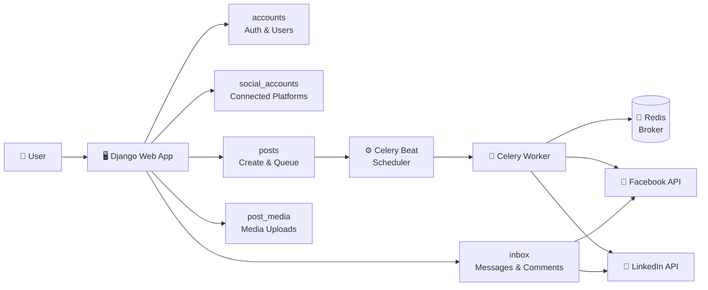

<div align="center">


<br/>

[](https://github.com/nawabsakib5/Social-Media-Manager/stargazers)
[](https://github.com/nawabsakib5/Social-Media-Manager/network/members)
[](https://github.com/nawabsakib5/Social-Media-Manager/commits/main)
[](#-license)

</div>

---

## 🧠 About The Project

**Social Media Manager** is a Django-powered dashboard that centralizes social media operations — connecting brand accounts (Facebook Pages, LinkedIn, and more), scheduling and auto-publishing posts, managing media, and replying to messages from a single unified inbox. Built with **Celery + Redis** for reliable background task scheduling, it's designed for freelancers, agencies, and small brands who juggle multiple platforms daily.

<div align="center">

</div>

---

## 📚 Table of Contents

- [✨ Features](#-features)
- [🏗️ Architecture](#️-architecture)
- [📁 Project Structure](#-project-structure)
- [🚀 Getting Started](#-getting-started)
- [⚙️ Environment Variables](#️-environment-variables)
- [☁️ Deployment](#️-deployment)
- [🗺️ Roadmap](#️-roadmap)
- [👤 Author](#-author)

---

## ✨ Features

<table>
<tr>
<td width="50%" valign="top">

### 🔗 Multi-Platform Integration
Connect Facebook Pages, LinkedIn profiles, and other social accounts through OAuth — all from one dashboard.

### ⏰ Post Scheduling & Automation
Create, queue, and auto-publish posts using **Celery Beat**. Set it once, let it run.

### 📥 Unified Inbox
Read and reply to comments/messages from every connected platform without switching tabs.

</td>
<td width="50%" valign="top">

### 🖼️ Media Management
Upload and organize images/videos attached to scheduled posts.

### 👥 Custom User Accounts
Secure authentication built on a custom Django user model.

### 🔄 Real-Time Sync
Keeps connected accounts and post statuses in sync with platform APIs.

</td>
</tr>
</table>

---

## 🏗️ Architecture



---

## 📁 Project Structure

```text
Social-Media-Manager/
├── accounts/              # Custom user model & authentication
├── config/                # Django settings & root URLs
├── inbox/                 # Unified inbox for messages/comments
├── integrations/          # OAuth & API integrations (Facebook, LinkedIn...)
├── post_media/            # Media (image/video) handling for posts
├── posts/                 # Post creation, scheduling & publishing
├── social_accounts/       # Connected social account management
├── templates/             # HTML templates
├── celerybeat-schedule*    # Celery Beat schedule DB files
├── create_superuser.py    # Auto-create Django superuser
├── manage.py               # Django management entry point
├── render.yaml              # Render deployment config
├── requirements.txt          # Python dependencies
└── start.bat                  # Windows quick-start script
```

---

## 🚀 Getting Started

### ✅ Prerequisites


### 📦 Installation

```bash
# 1. Clone the repository
git clone https://github.com/nawabsakib5/Social-Media-Manager.git
cd Social-Media-Manager

# 2. Create & activate a virtual environment
python -m venv venv
source venv/bin/activate      # Windows: venv\Scripts\activate

# 3. Install dependencies
pip install -r requirements.txt

# 4. Apply migrations
python manage.py migrate

# 5. Create a superuser
python create_superuser.py

# 6. Run the development server
python manage.py runserver
```

### 🔄 Running Celery (for scheduled posting)

```bash
# Terminal 1 — Redis
redis-server

# Terminal 2 — Celery worker
celery -A config worker -l info

# Terminal 3 — Celery beat (scheduler)
celery -A config beat -l info
```

> 💡 **Windows tip:** run `start.bat` to spin up services quickly.

---

## ⚙️ Environment Variables

Create a `.env` file in the project root:

```env
SECRET_KEY=your-django-secret-key
DEBUG=True
DATABASE_URL=your-database-url
REDIS_URL=redis://localhost:6379/0
FACEBOOK_APP_ID=your-facebook-app-id
FACEBOOK_APP_SECRET=your-facebook-app-secret
LINKEDIN_CLIENT_ID=your-linkedin-client-id
LINKEDIN_CLIENT_SECRET=your-linkedin-client-secret
```

---

## ☁️ Deployment

<div align="left">

</div>

This project ships with a `render.yaml` for one-click deployment to **Render**. For scheduled posting to work in production, provision a **Redis instance** plus a background **Celery worker + beat** service alongside the main web service.

---

## 🗺️ Roadmap

- [ ] 📸 Instagram integration
- [ ] 📊 Analytics dashboard for post performance
- [ ] 👥 Multi-user team collaboration per brand
- [ ] 🔔 Notification system for failed posts
- [ ] 🌐 Public API for third-party access

---

## 👤 Author

<div align="center">


**Mohammad Sakib**

[](https://github.com/nawabsakib5)

</div>

---

## 📄 License

This project is currently **licensed**. Reach out to the author for usage permissions.

<div align="center">

</div>
